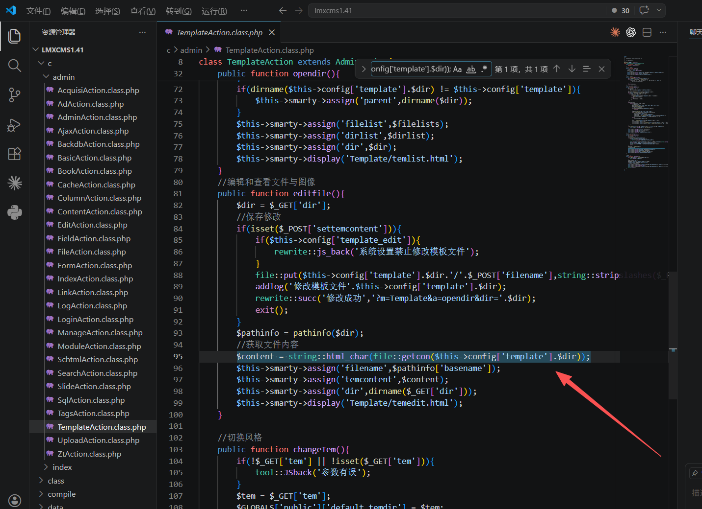
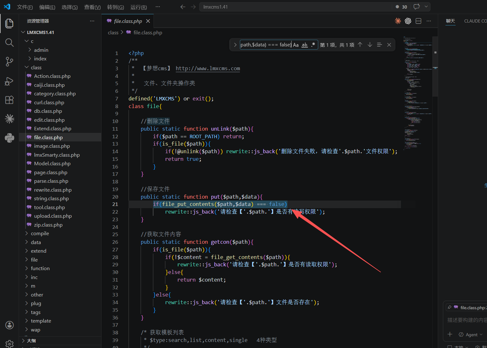
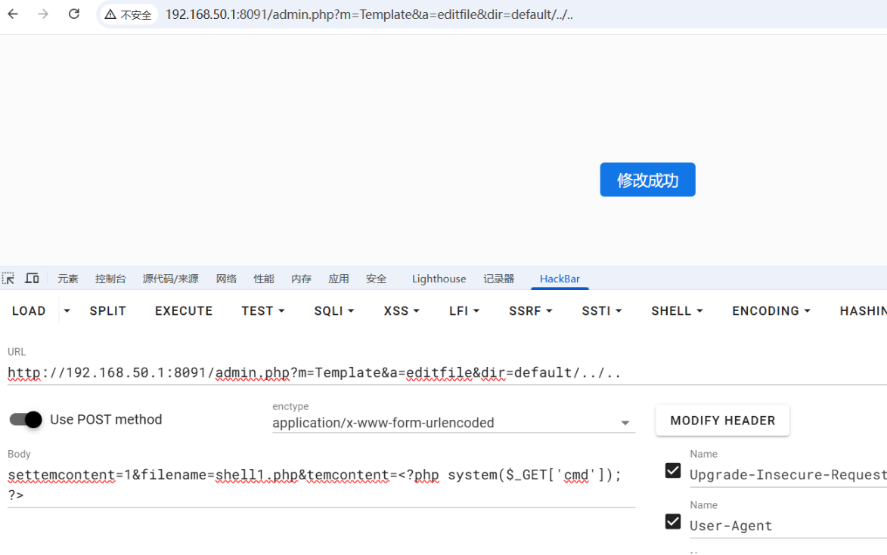
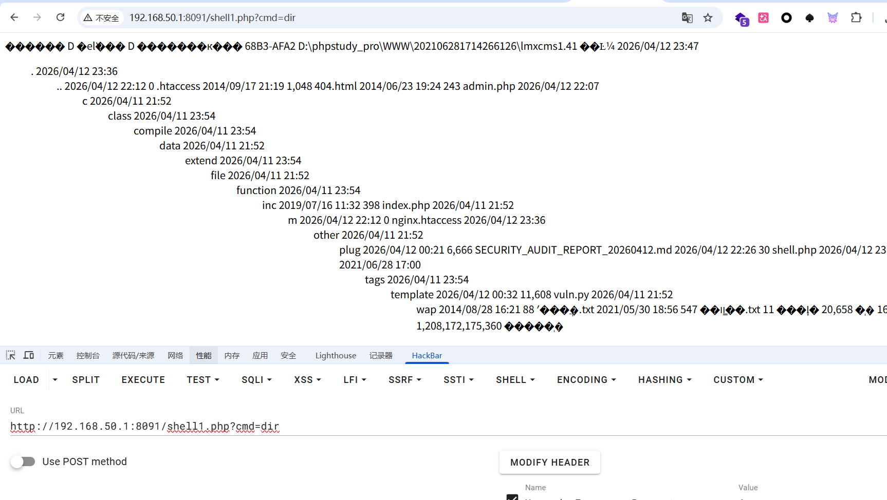

# LMXCMS 1.41 Authenticated Path Traversal Leading to Arbitrary File Write and Remote Code Execution

## Title

LMXCMS 1.41 contains an authenticated path traversal vulnerability in the template editor that allows arbitrary file write and leads to remote code execution.

## Description

An authenticated arbitrary file write vulnerability exists in LMXCMS version 1.41 in the backend template editor endpoint `/admin.php?m=Template&a=editfile`. The application concatenates the user-controlled `dir` and `filename` parameters into a filesystem path without canonicalization or boundary enforcement. An authenticated attacker can use directory traversal sequences such as `../` to escape the template directory and write arbitrary PHP files into the web root, resulting in remote code execution.

## Product

- Vendor: LMXCMS
- Product: LMXCMS
- Affected Version: 1.41

## Vulnerability Type

- CWE-22: Improper Limitation of a Pathname to a Restricted Directory
- CWE-73: External Control of File Name or Path
- CWE-434: Unrestricted Upload of File with Dangerous Type
- CWE-94: Improper Control of Generation of Code

## Affected Component

- Backend template editor
- Route: `/admin.php?m=Template&a=editfile`
- Controller: `c/admin/TemplateAction.class.php`

## Technical Details

The template editor is intended to modify files under the template directory, but the implementation directly concatenates attacker-controlled path elements.

Relevant code:

### File write

File: `c/admin/TemplateAction.class.php`

```php
file::put($this->config['template'].$dir.'/'.$_POST['filename'],string::stripslashes($_POST['temcontent']));
```
https://github.com/myift/ideal-potato/blob/main/cve/source/imgs/lmxcms%20backend%20rce/image-20260412233643594.png?raw=true


### File read

File: `c/admin/TemplateAction.class.php`

```php
$content = string::html_char(file::getcon($this->config['template'].$dir));
```



### Low-level write primitive

File: `class/file.class.php`

```php
if(file_put_contents($path,$data) === false)
    rewrite::js_back('请检查【'.$path.'】是否有读写权限');
```

Because `dir` is not normalized with `realpath()` and not checked to remain under the template root, an attacker can traverse out of the template directory and write to arbitrary relative locations.

In the tested deployment, the following traversal was sufficient to reach the application web root:

```text
dir=default/../..
```

This allowed writing a PHP file directly into the site root.



## Attack Vector

- Remote
- Network exploitable
- Authentication required
- No further user interaction required after authentication

## Authentication Context

The vulnerable controller inherits from `AdminAction`, so a valid backend session is required.

Relevant code:

File: `c/admin/AdminAction.class.php`

```php
$this->username = LoginAction::isloginAction();
```

## Proof of Concept

### Write a PHP file into the web root

Log in to the lmxcm backend using admin/admin credentials.



### Trigger code execution




## Impact

Successful exploitation allows an authenticated attacker to:

- Read arbitrary files reachable through traversal
- Write arbitrary files outside the template directory
- Drop executable PHP scripts into the web root
- Achieve remote code execution in the security context of the PHP/web service process
- Potentially fully compromise the server depending on service account privileges

## CVSS v3.1

### Suggested Score

- 8.8 High


